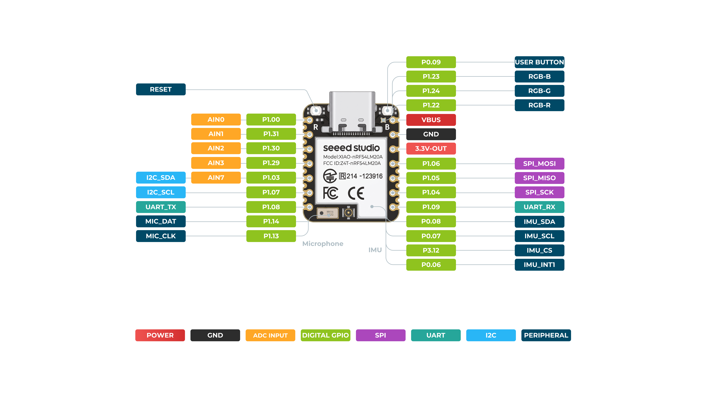

# <picture><source media="(prefers-color-scheme: dark)"></picture> nRF54L Arduino Core

<div align="center">

**Bare-metal Cortex-M33 + RISC-V. No Zephyr. No nRF Connect SDK.**

[](https://github.com/lolren/nrf54-arduino-core/releases)
[](#-supported-boards)
[](#)

*The most advanced bare-metal Arduino core for Nordic's latest-generation SoC — BLE, 802.15.4, Thread, Matter, Zigbee, and a RISC‑V coprocessor, all without a vendor RTOS.*

</div>

---

## 🔧 Zero-Dependency Upload (v0.9.100+)

Starting with v0.9.100, this core ships **[nrf_ocd](https://github.com/lolren/open-nrf-ocd)** — a **native C CMSIS-DAP programmer** that replaces pyOCD entirely.

| Before (pyOCD) | After (nrf_ocd) |
|---|---|
| 50+ Python packages | **0 external deps** |
| pip/virtualenv setup | **Single ~100KB binary** |
| AppImage IDE broken | **Works everywhere** (statically linked libusb/hidapi) |
| 50MB tool download | **~65KB download** |

nrf_ocd is automatically detected and used by the upload flow. No user configuration needed.

---

## ⚡ Quick Install

```
https://raw.githubusercontent.com/lolren/nrf54-arduino-core/main/package_nrf54l15clean_index.json
```

Add this URL in **Arduino IDE → Preferences → Additional Boards Manager URLs**, then install **nRF54L15 Boards** from the Boards Manager.

```cpp
#include <nrf54_all.h>
void setup() { Serial.begin(115200); Serial.println("Hello nRF54!"); }
void loop() {}
```

---


Starting with v0.9.100, this core ships **[nrf_ocd](https://github.com/lolren/open-nrf-ocd)** — a **native C CMSIS-DAP programmer** that replaces pyOCD entirely.

| Before (pyOCD) | After (nrf_ocd) |
|---|---|
| 50+ Python packages | **0 external deps** |
| pip/virtualenv setup | **Single ~100KB binary** |
| AppImage IDE broken | **Works everywhere** (statically linked libusb/hidapi) |
| 50MB tool download | **~65KB download** |

nrf_ocd is automatically detected and used by the upload flow. No user configuration needed.

---

## 🖥️ Supported Boards

<div align="center">

| | |
|---|---|
| <br>**XIAO nRF54L15**<br>`xiao_nrf54l15` | <br>**XIAO nRF54LM20A / Sense**<br>`xiao_nrf54lm20b` |
| <br>**HOLYIOT-25007**<br>`holyiot_25007_nrf54l15` | <br>**HOLYIOT-25008**<br>`holyiot_25008_nrf54l15` |

</div>

| Board | Specs |
|---|---|
| **XIAO nRF54L15** | 128 MHz M33 · 1.5 MB NVM · 512 KB RAM |
| **XIAO nRF54LM20A / Sense** | 128 MHz M33 · 2 MB NVM · 512 KB RAM · nPM1300 PMIC · onboard PY25Q64 QSPI flash · LSM6DS3TR‑C IMU + MSM261DGT006 mic (Sense) · [back pinout](docs/nrf54lm20a_back_pinout.png) · [official wiki](https://wiki.seeedstudio.com/xiao_nrf54lm20a_getting_started/) |
| **HOLYIOT-25007** | 18.0 × 14.8 mm · PCB antenna |
| **HOLYIOT-25008** | 23.2 × 17.5 mm · PCB antenna |

> See [board reference](docs/board-reference.md) for detailed pin assignments and schematics.

---


Starting with v0.9.100, this core ships **[nrf_ocd](https://github.com/lolren/open-nrf-ocd)** — a **native C CMSIS-DAP programmer** that replaces pyOCD entirely.

| Before (pyOCD) | After (nrf_ocd) |
|---|---|
| 50+ Python packages | **0 external deps** |
| pip/virtualenv setup | **Single ~100KB binary** |
| AppImage IDE broken | **Works everywhere** (statically linked libusb/hidapi) |
| 50MB tool download | **~65KB download** |

nrf_ocd is automatically detected and used by the upload flow. No user configuration needed.

---

## ⚡ Why Bare Metal?

| | This Core | nRF Connect SDK |
|---|---|---|
| **RTOS** | None (opt-in Thread/Matter) | Zephyr RTOS mandatory |
| **Binary size** | ~12 KB blink | ~100 KB+ blink |
| **Compiler** | GCC | GCC + Zephyr build system |
| **Peripheral access** | Direct register writes | Vendor HAL + DTS |
| **BLE stack** | Custom register‑level | SoftDevice / Zephyr BLE |
| **RISC‑V coprocessor** | Fully usable | Limited Arduino access |
| **Learning curve** | Datasheet + Arduino API | Zephyr + DTS + Kconfig |

**This core is for developers who want full hardware control with Arduino convenience.**

---


Starting with v0.9.100, this core ships **[nrf_ocd](https://github.com/lolren/open-nrf-ocd)** — a **native C CMSIS-DAP programmer** that replaces pyOCD entirely.

| Before (pyOCD) | After (nrf_ocd) |
|---|---|
| 50+ Python packages | **0 external deps** |
| pip/virtualenv setup | **Single ~100KB binary** |
| AppImage IDE broken | **Works everywhere** (statically linked libusb/hidapi) |
| 50MB tool download | **~65KB download** |

nrf_ocd is automatically detected and used by the upload flow. No user configuration needed.

---

## ✨ Feature Matrix

### 📡 Wireless

| | BLE | 802.15.4 | Thread | Zigbee | Matter | CS |
|---|---|---|---|---|---|---|
| **Advertising** | ✅ | — | — | — | — | — |
| **Scanning** | ✅ | — | — | — | — | — |
| **1M / 2M / Coded PHY** | ✅ | — | — | — | — | — |
| **GATT Server + Client** | ✅ | — | — | — | — | — |
| **Bluefruit API** | ✅ | — | — | — | — | — |
| **LE Secure Connections** | ✅ | — | — | — | — | — |
| **OOB + Numeric Comparison** | ⚠️ | — | — | — | — | — |
| **Privacy / RPA** | ⚠️ | — | — | — | — | — |
| **Channel Sounding Mode 2** | ⚠️ | — | — | — | — | ⚠️ |
| **MAC / NWK / APS** | — | ✅ | ⚠️ | ⚠️ | — | — |
| **Coordinator / Router** | — | — | ⚠️ | ⚠️ | — | — |
| **End Device** | — | — | ⚠️ | ⚠️ | — | — |
| **UDP Transport** | — | — | ⚠️ | — | — | — |
| **ZCL (OnOff / Level / Temp)** | — | — | — | ⚠️ | — | — |
| **On/Off Light + commissioning** | — | — | — | — | ⚠️ | — |

### 🔐 Crypto

| | Hardware | Status |
|---|---|---|
| **CRACEN RNG** | ✅ | Production |
| **CRACEN IKG** | ✅ | 0 ms key generation |
| **AES‑CCM / AES‑ECB** | ✅ | Hardware‑accelerated |
| **PBKDF2‑HMAC‑SHA256** | ✅ | Hardware‑accelerated |
| **ECDSA sign** | ✅ | ~0.84 s |
| **ECDSA verify** | ✅ | ~1.76 s |
| **secp256r1 ECC** | ⚠️ | Software‑only (CRACEN PK engine needs Nordic microcode) |

### 🎛️ Peripherals

| | Status |
|---|---|
| **GPIO, PWM, ADC, I2C, SPI, UART** | ✅ |
| **HS-SPI 32 MHz** (`SPI_HS`) | ✅ |
| **I2S, PDM Microphone** | ✅ |
| **QDEC** (rotary encoder) | ✅ |
| **NFC‑A Tag** | ✅ |
| **Temperature Sensor** | ✅ |
| **Comparator, LPCOMP** | ✅ |
| **Watchdog Timer** | ✅ |
| **Deep Sleep / System OFF** | ✅ |
| **DPPI** (hardware event system) | ✅ |
| **Tamper Detection** | ✅ |
| **KMU** (key management) | ✅ |

### 🧠 System

| | Status |
|---|---|
| **VPR RISC‑V Coprocessor** | ✅ |
| **SoftPeripheral SDK + sQSPI** | ✅ |
| **nPM1300 PMIC Driver** | ✅ |
| **LM20A QSPI Flash + Sleep** | ✅ |
| **GPIO Bit‑Bang I²C** (zero residual) | ✅ |
| **Buck Hysteretic Mode** (µA sleep) | ✅ |
| **LM20A IMU** (LSM6DS3TR‑C) | ✅ |
| **LM20A PDM Mic** (MSM261DGT006) | ✅ |

---


Starting with v0.9.100, this core ships **[nrf_ocd](https://github.com/lolren/open-nrf-ocd)** — a **native C CMSIS-DAP programmer** that replaces pyOCD entirely.

| Before (pyOCD) | After (nrf_ocd) |
|---|---|
| 50+ Python packages | **0 external deps** |
| pip/virtualenv setup | **Single ~100KB binary** |
| AppImage IDE broken | **Works everywhere** (statically linked libusb/hidapi) |
| 50MB tool download | **~65KB download** |

nrf_ocd is automatically detected and used by the upload flow. No user configuration needed.

---

> **Legend:** ✅ Production &nbsp; ⚠️ Experimental / Partial &nbsp; 🚧 In Development

---


Starting with v0.9.100, this core ships **[nrf_ocd](https://github.com/lolren/open-nrf-ocd)** — a **native C CMSIS-DAP programmer** that replaces pyOCD entirely.

| Before (pyOCD) | After (nrf_ocd) |
|---|---|
| 50+ Python packages | **0 external deps** |
| pip/virtualenv setup | **Single ~100KB binary** |
| AppImage IDE broken | **Works everywhere** (statically linked libusb/hidapi) |
| 50MB tool download | **~65KB download** |

nrf_ocd is automatically detected and used by the upload flow. No user configuration needed.

---

## SPI Speed And Routing

| Board family | External Arduino `SPI` pins | Implemented max on exposed pins | `SPI_HS` / 32 MHz status |
|---|---|---|---|
| **XIAO nRF54L15 / Sense** | `D8=SCK`, `D9=MISO`, `D10=MOSI`, `D2=SS` on the nRF54L15 high-speed `SPIM00` route | 32 MHz requestable through `SPISettings(SPI_CLOCK_32M, ...)` | `SPI_HS` aliases `SPI`, so the normal header SPI path is the HS path |
| **HOLYIOT-25007 / 25008 / nRF54L15 module boards** | Board/module `D8/D9/D10/D2` SPI route on nRF54L15 `SPIM00` | 32 MHz requestable where board wiring and the attached device allow it | `SPI_HS` aliases `SPI` |
| **XIAO nRF54LM20A / Sense** | `D8=SCK`, `D9=MISO`, `D10=MOSI`, `D2=SS` on serial-fabric `SPIM22` | 8 MHz on the exposed XIAO header pins | `SPI_HS` uses `SPIM00`, but those pins are the onboard PY25Q64 QSPI flash bus, not the XIAO header |

Notes:

- The **64 MHz / 128 MHz CPU menu does not set the SPI SCK ceiling**. SPI speed comes from the selected SPIM peripheral clock and its prescaler.
- On **LM20A**, external BMP388/SD/MCP2515-style devices should use normal `SPI` on `D8/D9/D10`; that path is working but is limited to 8 MHz by the board/peripheral route.
- On **LM20A**, the 32 MHz `SPI_HS` path is useful for the onboard QSPI flash and deliberate advanced probing of the flash pads. The schematic does not expose that HS bus on the normal XIAO header.
- Examples: `File > Examples > Peripherals > HighSpeedSpi32MHzProbe`, `File > Examples > XiaoLM20A > QspiFlashInfo`, and `File > Examples > Adafruit SPIFlash > FlashInfo`.

## LM20A Onboard QSPI Flash

XIAO nRF54LM20A includes an onboard P25Q64/PY25Q64-class 8 MB flash on the dedicated QSPI/HS-SPI pads. The core exposes it in two layers:

- `XiaoQspiFlash` for board-specific low-level control, including JEDEC read, read/write/erase, and `prepareForSleep()`.
- `Adafruit_SPIFlash` compatibility with `Adafruit_FlashTransport_QSPI_NRF54`, so sketches can use common `begin()`, `readBuffer()`, `writeBuffer()`, `eraseSector()`, `readJEDECID()`, and `runCommand(0xB9)` style calls.

For low-current sleep on LM20A, put the external flash into deep power-down before sleeping. Use `XiaoQspiFlash.prepareForSleep()` or `flash.runCommand(0xB9); flash.end();` from the SPIFlash-compatible API.

Examples:

- `File > Examples > XiaoLM20A > QspiFlashInfo`
- `File > Examples > XiaoLM20A > QspiFlashReadWrite`
- `File > Examples > Adafruit SPIFlash > FlashInfo`
- `File > Examples > Bluefruit52Lib > Diagnostics > lm20a_spiflash_sleep_adv`

---


Starting with v0.9.100, this core ships **[nrf_ocd](https://github.com/lolren/open-nrf-ocd)** — a **native C CMSIS-DAP programmer** that replaces pyOCD entirely.

| Before (pyOCD) | After (nrf_ocd) |
|---|---|
| 50+ Python packages | **0 external deps** |
| pip/virtualenv setup | **Single ~100KB binary** |
| AppImage IDE broken | **Works everywhere** (statically linked libusb/hidapi) |
| 50MB tool download | **~65KB download** |

nrf_ocd is automatically detected and used by the upload flow. No user configuration needed.

---

## 📊 Stack Maturity

| Stack | Lines | Maturity | Production Ready? |
|---|---|---|---|
| **Arduino Core** | ~150K | ✅ Mature | Yes — GPIO, PWM, ADC, I2C, SPI, UART, I2S, PDM, NFC |
| **BLE** | ~80K | ✅ Mature | Yes — advertising, scanning, connections, GATT, Bluefruit |
| **Zigbee** | ~40K | ⚠️ Good | Partial — ZCL clusters missing, no OTA |
| **Thread** | ~30K | ⚠️ Early | No — compile‑only, no commissioner validation |
| **Matter** | ~25K | ⚠️ Early | No — data models compile, no network‑layer completion |
| **Channel Sounding** | ~8K | ⚠️ Partial | Mode 2 works on 2‑board, needs VPR coprocessor |
| **PMIC Driver** | ~3K | ✅ Mature | Yes — all nPM1300 features, GPIO bit‑bang I²C |

---


Starting with v0.9.100, this core ships **[nrf_ocd](https://github.com/lolren/open-nrf-ocd)** — a **native C CMSIS-DAP programmer** that replaces pyOCD entirely.

| Before (pyOCD) | After (nrf_ocd) |
|---|---|
| 50+ Python packages | **0 external deps** |
| pip/virtualenv setup | **Single ~100KB binary** |
| AppImage IDE broken | **Works everywhere** (statically linked libusb/hidapi) |
| 50MB tool download | **~65KB download** |

nrf_ocd is automatically detected and used by the upload flow. No user configuration needed.

---

## ⚠️ Known Limitations

- **ECC secp256r1 is software‑only.** The CRACEN PK engine needs proprietary Nordic microcode. Thread/Matter pairing takes 2‑5 seconds of CPU‑bound crypto.
- **Thread and Matter are compile‑targets only** — not functional protocol stacks. End‑to‑end commissioner validation is pending.
- **Zigbee is functional but incomplete** — many ZCL clusters, OTA, and multi‑hop routing are missing.
- **LM20A has two SPI paths:** `SPI` stays on the XIAO header pins; `SPI_HS` is the onboard QSPI flash bus and is only for deliberate HS-SPI/QSPI-pad use.
- **P2 GPIO port has no interrupt/wake capability** (hardware limitation).
- **Channel Sounding Mode 2** needs the VPR RISC‑V coprocessor — M33 alone can't keep up with subevent timing.

---


Starting with v0.9.100, this core ships **[nrf_ocd](https://github.com/lolren/open-nrf-ocd)** — a **native C CMSIS-DAP programmer** that replaces pyOCD entirely.

| Before (pyOCD) | After (nrf_ocd) |
|---|---|
| 50+ Python packages | **0 external deps** |
| pip/virtualenv setup | **Single ~100KB binary** |
| AppImage IDE broken | **Works everywhere** (statically linked libusb/hidapi) |
| 50MB tool download | **~65KB download** |

nrf_ocd is automatically detected and used by the upload flow. No user configuration needed.

---

## 🔗 Links

- **[Board Reference & Pinouts](docs/board-reference.md)**
- **[Development Guide](docs/development.md)**
- **[BLE Status & Resume Checklist](docs/BLE_COMPLIANCE_RESUME.md)**
- **[Thread & Matter Implementation Plan](docs/THREAD_MATTER_IMPLEMENTATION_PLAN.md)**
- **[Power Profile Measurements](POWER_PROFILE_MEASUREMENTS.md)**

---


Starting with v0.9.100, this core ships **[nrf_ocd](https://github.com/lolren/open-nrf-ocd)** — a **native C CMSIS-DAP programmer** that replaces pyOCD entirely.

| Before (pyOCD) | After (nrf_ocd) |
|---|---|
| 50+ Python packages | **0 external deps** |
| pip/virtualenv setup | **Single ~100KB binary** |
| AppImage IDE broken | **Works everywhere** (statically linked libusb/hidapi) |
| 50MB tool download | **~65KB download** |

nrf_ocd is automatically detected and used by the upload flow. No user configuration needed.

---

<div align="center">

**Built from datasheets. Verified on hardware. No vendor blobs.**

---


Starting with v0.9.100, this core ships **[nrf_ocd](https://github.com/lolren/open-nrf-ocd)** — a **native C CMSIS-DAP programmer** that replaces pyOCD entirely.

| Before (pyOCD) | After (nrf_ocd) |
|---|---|
| 50+ Python packages | **0 external deps** |
| pip/virtualenv setup | **Single ~100KB binary** |
| AppImage IDE broken | **Works everywhere** (statically linked libusb/hidapi) |
| 50MB tool download | **~65KB download** |

nrf_ocd is automatically detected and used by the upload flow. No user configuration needed.

---

## 🔧 Troubleshooting

### Linux: Upload fails with "hidraw access denied"

```
ERROR: CMSIS-DAP probe 2886:0068 is present but hidraw access is denied.
```

**Fix:** Copy the udev rules and replug the board:

```bash
sudo cp ~/.arduino15/packages/nrf54l15clean/tools/nrf54l15hosttools/*/setup/60-seeed-xiao-nrf54-cmsis-dap.rules /etc/udev/rules.d/
sudo udevadm control --reload-rules && sudo udevadm trigger
# Unplug and replug the board
```

> This is a one-time setup. The udev rule grants plugdev group access to `/dev/hidraw*` and the USB device node. Covers both L15 (0066) and LM20A (0068).

### Linux Mint: No probe detected even after udev rules

If `pyocd list` shows no probes but `lsusb` shows the board, check:

```bash
ls -la /dev/bus/usb/*/???   # USB device should be rw for plugdev
ls -la /dev/hidraw*          # hidraw should be rw for plugdev
groups                       # verify you're in plugdev group
```

If USB device is root-only, the udev rule didn't trigger. Replug the board or run `sudo udevadm trigger`.

</div>
